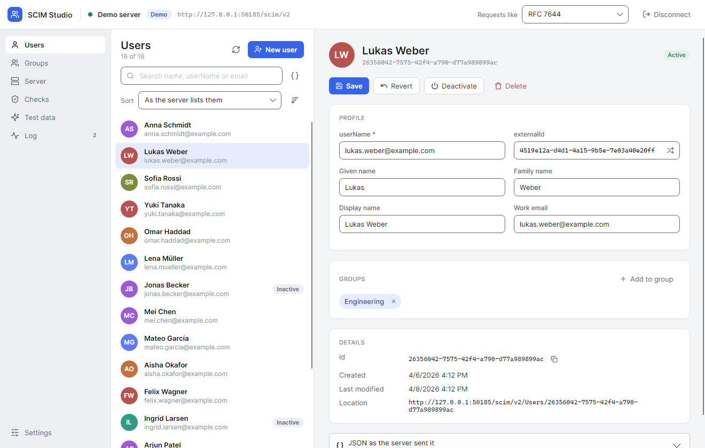
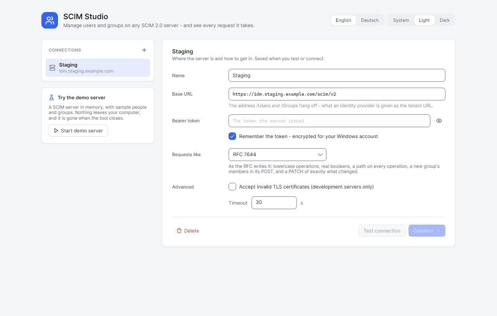
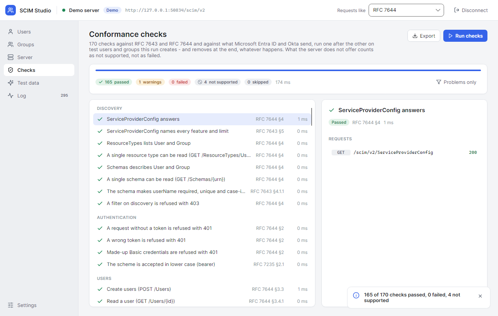
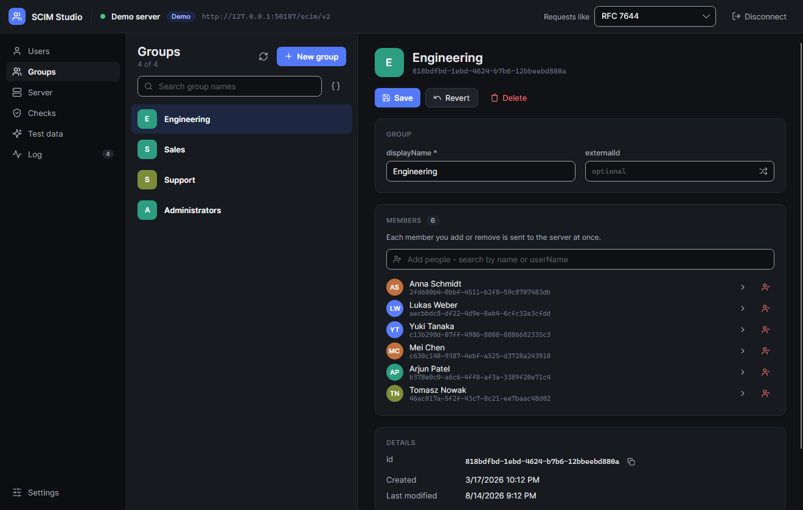
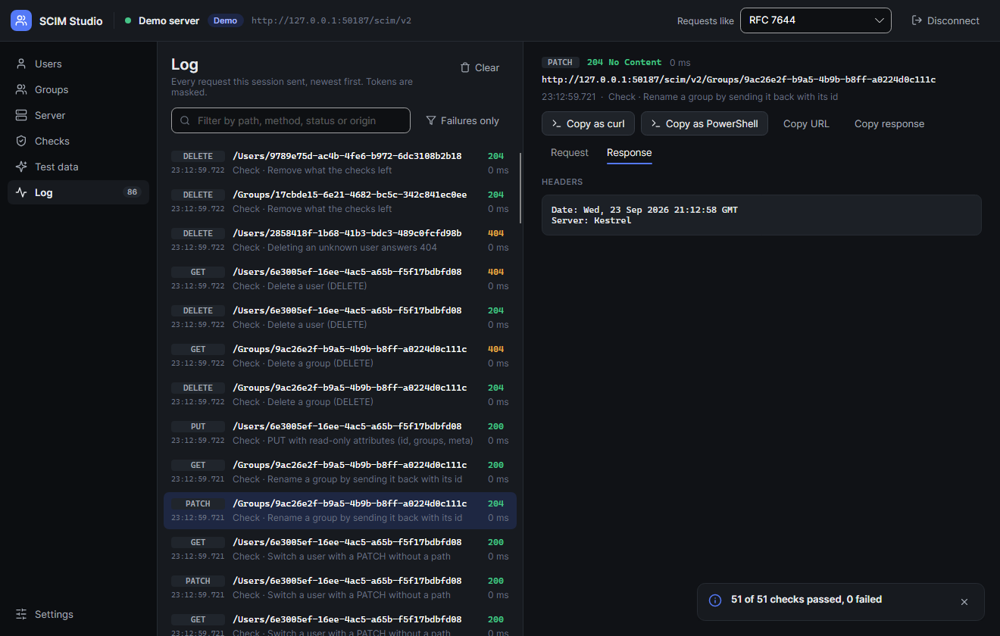

# SCIM Studio

**A local desktop GUI for testing SCIM 2.0 servers** - manage users and
groups, run conformance checks, send requests the way Microsoft Entra ID and
Okta do, and inspect every request. Windows, macOS and Linux.

Built for anyone implementing a SCIM service provider
([RFC 7643](https://www.rfc-editor.org/rfc/rfc7643), [RFC 7644](https://www.rfc-editor.org/rfc/rfc7644)):
point it at a base URL and a bearer token and it becomes a small user
administration that talks to your server the way an identity provider does -
and shows you every request it sends.

> [!NOTE]
> The downloads are not code-signed, so Windows and macOS warn on the first
> start. On Windows choose *More info* → *Run anyway*; on macOS *Open Anyway*
> under *System Settings → Privacy & Security*.



## What it does

- **Users and groups, live.** Create, edit, activate, deactivate and delete
  users; create, rename and delete groups and add or remove their members.
  Every change goes to the server at once, and the list and the editor show
  what the server answered.
- **Requests like Entra ID or Okta.** Switch the *dialect* in the top bar and
  the same form writes its requests the way that provider does: capitalised
  operations and `"False"` for Microsoft Entra ID, a `PUT` of the whole user
  for Okta, lookups before every create, members removed by value or by
  filtered path. A server that works with one of them can break with another;
  this is how to find out before a customer does.
- **Conformance checks.** One click runs some 170 checks: discovery,
  authentication, CRUD, every filter operator, paging, sorting, `attributes`
  and `excludedAttributes`, PATCH and PUT down to atomicity and read-only
  attributes, group membership, the enterprise extension, media types and
  errors, ETags, bulk and `/Me` - and the habits of Entra ID and Okta. What
  the server does not offer, by its configuration or by how it answers,
  counts as *not supported* rather than failed. Each check says why, links to
  the requests it sent, and the list narrows to the problems with one click.
  Everything a run creates is removed at the end, even when it is cancelled.
- **Reports.** Export a run as a Markdown report - problems first, every
  check, and each request and answer of what did not pass - or as JSON with
  every request and answer of every check. Right-click a check to copy it as
  Markdown or JSON, or its requests as curl or PowerShell commands. The token
  is in none of them.
- **Test data.** Generate a few hundred realistic people and groups to page,
  sort and filter through, and remove them again with one click - they carry
  an `externalId` starting with `scimstudio-gen-`, so they are found on a later
  day too.
- **The log.** Every request and answer of the session, headers and bodies,
  newest first. Copy any request as `curl` or PowerShell; the token becomes
  `$SCIM_TOKEN`, so the command can go into a ticket as it is.
- **Discovery.** The server's `ServiceProviderConfig`, resource types and
  schemas, attribute by attribute.
- **A demo server built in.** No server at hand? Start the in-memory one from
  the start page: sample people and groups, nothing leaves your computer.

English and German, light and dark, on Windows, macOS and Linux.

| | |
| --- | --- |
|  |  |
|  |  |

## Getting started

Download SCIM Studio for your system from the [releases](../../releases);
each download brings its own .NET runtime.

- **Windows:** unpack the zip and run `ScimStudio.exe`.
- **macOS 14 or later:** open the disk image - `osx-arm64` for Apple silicon,
  `osx-x64` for Intel - and drag *SCIM Studio* onto *Applications*.
- **Linux:** unpack the archive and run `./ScimStudio`.

Or run it from source with the [.NET 10 SDK](https://dotnet.microsoft.com/download):

```bash
dotnet run --project src/ScimStudio.App
```

### Connecting

A connection is a **base URL** - the address `/Users` and `/Groups` hang off,
such as `https://idm.example.com/scim/v2` - and a **bearer token**, the same
two things an identity provider is given. *Test connection* reads the
`ServiceProviderConfig` and one page of users and groups, and says what the
server supports or why it refused.

The token is remembered only if you ask. On Windows it is encrypted for your
account (DPAPI); elsewhere it is kept in the settings file, which only your
account may read. The settings live in `%APPDATA%\ScimStudio` on Windows and
in `~/.config/ScimStudio` on macOS and Linux.

A development server with a self-signed certificate can be reached by ticking
*Accept invalid TLS certificates* in the connection's advanced settings.

## Dialects

| | Create | Change a user | Switch a user | Group members |
| --- | --- | --- | --- | --- |
| **RFC 7644** | `POST`, members in the body | `PATCH` of exactly what changed | `replace` `active` with a boolean | `add` / `remove members[value eq "…"]` |
| **Microsoft Entra ID** | lookup by `userName`, then `POST`; groups filled afterwards | `Replace` / `Add` with paths, new name parts as dotted keys, address through `emails[type eq "work"].value` | `Replace` `active` with `"True"` / `"False"` | `Add` / `Remove` naming the members in the value |
| **Okta** | lookup by `userName`, then `POST` | `PUT` of the whole user, read-only `groups` and `meta` included | `replace` without a path: `{"active": false}` | `add`; rename by sending the group back with its id; `remove` one filtered path each |

The conformance checks write their own requests and cover all three.

## Building and testing

```bash
dotnet build ScimStudio.slnx                              # warnings are errors
dotnet test ScimStudio.slnx                               # everything below
dotnet format ScimStudio.slnx --verify-no-changes --include src/ tests/
```

The tests run the dialects, the conformance checks and the generator against
the demo server, hold the English and German catalogues to the same keys, and
check the 150-column limit `dotnet format` cannot apply. The app tests also
draw every page headlessly in both themes and both languages and save the
pictures under `artifacts/screenshots`, and the reports of their run under
`artifacts/reports` - no assertion can tell whether a layout or a report
reads right, so look at them after changing one.

A tag `v*` builds the downloads - one executable for Windows and Linux, an app
in a disk image for macOS (`packaging/macos`) - and attaches them to a GitHub
release. Started by hand under *Actions*, the same workflow builds them
without a release, to try them first. The release notes are the commits since
the tag before (`packaging/release-notes.sh`): features, fixes and speed-ups
with the first paragraph of their body, breaking changes with their
`BREAKING CHANGE:` footer, the rest folded away - each with its hash.

The version comes from the tag, locally as in CI: [MinVer](https://github.com/adamralph/minver)
reads the latest `v*` tag at build time, so `v1.2.0` builds 1.2.0 and a commit
after it 1.2.1-alpha.0.1. The app shows it under *Settings*.

## Layout

```
src/
├── ScimStudio.Core/        the SCIM client, the log, dialects, checks, generator - no UI
├── ScimStudio.DemoServer/  an in-memory SCIM 2.0 service provider on the loopback interface
└── ScimStudio.App/         the Avalonia desktop app
tests/
├── ScimStudio.Tests/       core and demo server, against a real server on a free port
└── ScimStudio.App.Tests/   view models, catalogues and screenshots, headless
```

## How it was made

> [!NOTE]
> SCIM Studio was built with AI assistance: most of its code, tests and
> documentation were written by Claude (Anthropic), working in Claude Code,
> from the author's requirements and decisions.

## Licence

[MIT](LICENSE). The icons are drawn after [Lucide](https://lucide.dev) (ISC).
